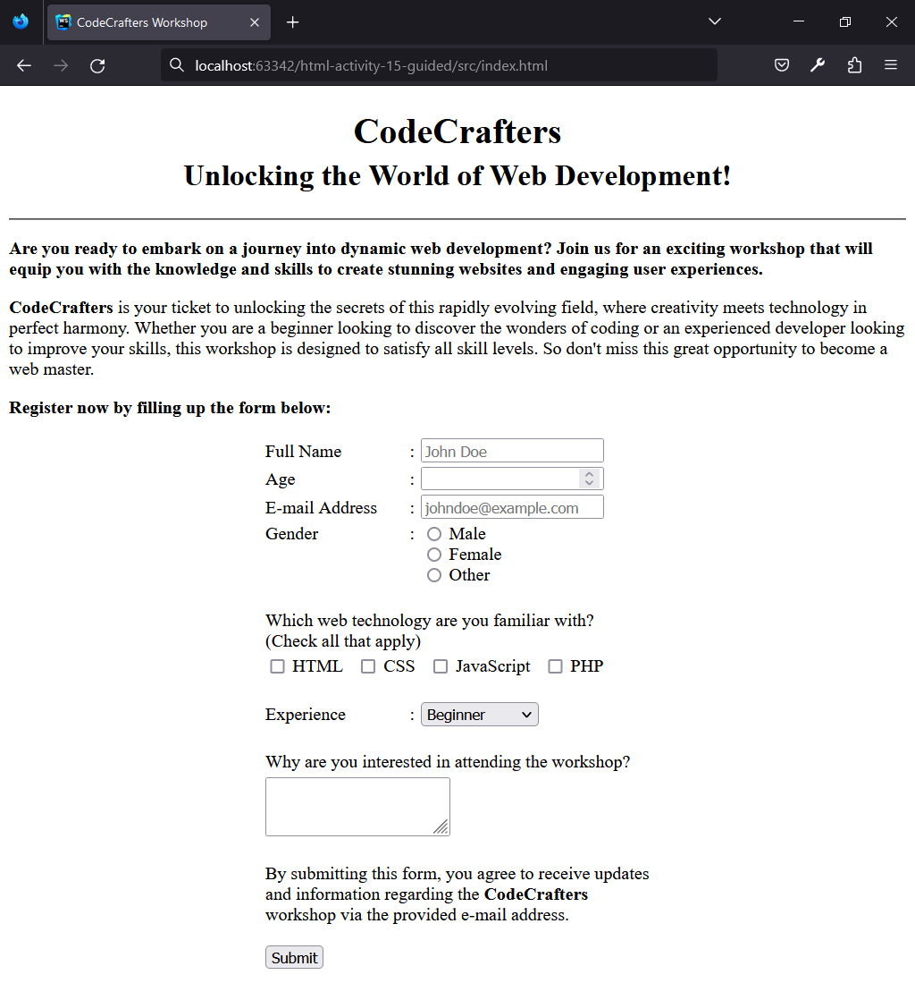
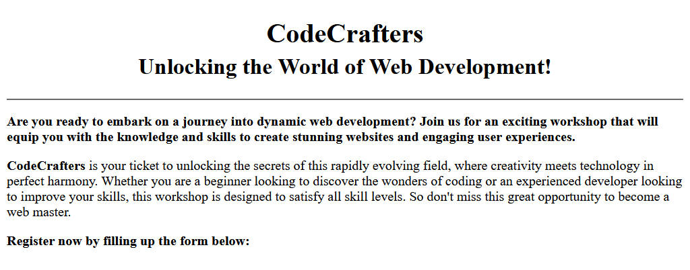

## HTML | Activity #15 (Guided): Forms (Part 1)
In this activity, we will create a **Workshop Registration Page** with the following content:




### Development Setup
Create your `index.html` file inside the [**src**](/src) folder in this project,
then follow along with this guide.

To test your output, simply open it in your preferred web browser.


### Template
First, we need a regular HTML template that already contains relevant texts.



The `<form>` tag creates a form on our webpage.
To organize our form elements,  we'll use a table layout
where each element will be placed in a separate row.

```html
<!DOCTYPE html>
<html lang="en">
<head>
    <meta charset="UTF-8">
    <title>CodeCrafters Workshop</title>
</head>
<body>
    <div class="header" align="center">
        <h1>
            CodeCrafters
            <br/>
            <small>Unlocking the World of Web Development!</small>
        </h1>
        <hr/>
    </div>

    <div class="intro">
        <p>
            <b>
                Are you ready to embark on a journey into dynamic web development?
                Join us for an exciting workshop that will equip you with the knowledge
                and skills to create stunning websites and engaging user experiences.
            </b>
        </p>
        <p>
            <b>CodeCrafters</b> is your ticket to unlocking the secrets
            of this rapidly evolving field, where creativity meets technology in perfect harmony.
            Whether you are a beginner looking to discover the wonders
            of coding or an experienced developer looking to improve your skills,
            this workshop is designed to satisfy all skill levels.
            So don't miss this great opportunity to become a web master.
        </p>
        <p>
            <b>Register now by filling up the form below:</b>
        </p>
    </div>

    <div class="registration" align="center">
        <form>
            <table width="350">

                <!-- Full Name -->

                
                <!-- Age -->


                <!-- E-mail Address -->


                <!-- Gender -->

                
                <!-- Web Technology -->

                
                <!-- Experience -->

                
                <!-- Reason -->

                
                <!-- Submit -->
                
            </table>
        </form>
    </div>
</body>
</html>
```


### Registration Form
The registration form is contained within the `<form>` tag.
Within a form, we can include various form elements.

#### Input
One of the form elements that we can use is the **input** element,
which is defined by the self-closing `<input/>` tag.

The `<input/>` tag has a `type` attribute
that determines how the input element appears and functions.

Example:
```html
<input type="text" />
```

<p>
    <small>
        <b>NOTE:</b>
        If the <code>type</code> attribute is not specified in an <code>&lt;input&gt;</code> tag,
        its default type is <code>"text"</code>.
    </small>
</p>


In this project, we will use the following input types:

| Type       | Element       |
|:-----------|---------------|
| `text`     | Text Input    |
| `number`   | Numeric Input |
| `email`    | Email Input   |
| `radio`    | Radio Button  |
| `checkbox` | Checkbox      |


#### Label
We will also use label elements, defined by the `<label>` tag,
which is used to associate a descriptive text or name to an input element.
When the label is clicked, the associated input element gets focussed or chosen.

To associate a label with an input element,
we need to assign an `id` value to the input element,
and use the same `id` value in the `for` attribute of the `<label>` tag.

Example:
```html
<label for="username">Enter your username:</label>
<input type="text" id="username"/>
```

##### 1. Full Name

We will collect text data from the **Full Name** field,
so we're going to use an `<input/>` tag with a `type` of  `"text"`.

```html
                ...
                
                <!-- Full Name -->
                <tr>
                    <td>
                        <label for="full-name">Full Name</label>
                    </td>
                    <td>:</td>
                    <td>
                        <input
                            type="text"
                            id="full-name"
                            placeholder="John Doe"
                        />
                    </td>
                </tr>
                
                ...
```
The `placeholder` attribute provides a hint or example text within the input field,
guiding the user on what kind of information should be entered.

##### 2. Age

We will collect numeric data from the **Age** field,
so we're going to use an `<input/>` tag with a `type` of  `"number"`.

```html
                ...
                
                <!-- Age -->
                <tr>
                    <td>
                        <label for="age">Age</label>
                    </td>
                    <td>:</td>
                    <td>
                        <input type="number" id="age" />
                    </td>
                </tr>
                
                ...
```

##### 3. E-mail Address

We will collect text data in *e-mail format* from the **E-mail Address** field,
so we're going to use an `<input/>` tag with a `type` of `"email"`.

```html
                ...

                <!-- E-mail Address -->
                <tr>
                    <td>
                        <label for="email">E-mail Address</label>
                    </td>
                    <td>:</td>
                    <td>
                        <input
                            type="email"
                            id="email"
                            placeholder="johndoe@example.com"
                        />
                    </td>
                </tr>
                
                ...
```
The `placeholder` attribute shows an example of a valid e-mail address.

##### 4. Gender


To collect **Gender** data, we will use three radio buttons:
`<input>` tags with `type` of `"radio"`.

```html
                ...
                
                <!-- Gender -->
                <tr>
                    <td valign="top">Gender</td>
                    <td valign="top">:</td>
                    <td>
                        <!-- Gender: Male -->
                        <div>
                            <input
                                type="radio"
                                name="gender"
                                id="gender-male"
                            />
                            <label for="gender-male">Male</label>
                        </div>
                
                        <!-- Gender: Female -->
                        <div>
                            <input
                                type="radio"
                                name="gender"
                                id="gender-female"
                            />
                            <label for="gender-female">Female</label>
                        </div>
                
                        <!-- Gender: Other -->
                        <div>
                            <input
                                type="radio"
                                name="gender"
                                id="gender-other"
                            />
                            <label for="gender-other">Other</label>
                        </div>
                    </td>
                </tr>
                
                ...
```

Notice that the `<input type="radio">` elements share a common `name` attribute.
```html
name="gender"
```
It limits the user to choose only one option at a time.

<p>
    <small>
        <b>NOTE:</b>
        If the <code>name</code> attribute is not set or different for the three radio buttons,
        it would result in them being treated as separate entities,
        allowing the user to select multiple options instead of just one.
    </small>
</p>

#####  5. Web Technology

To collect **Web Technology** data,
we will use four checkboxes: `<input>` tags with `type` of `"checkbox"`.

```html
                ...
                
                <!-- Web Technology -->
                <tr>
                    <td colspan="3">
                        <br/>
                        Which web technology are you familiar with?
                        <br/>
                        (Check all that apply)
                    </td>
                </tr>
                <tr>
                    <td colspan="3">
                
                        <!-- Web Technology: HTML -->
                        <span>
                            <input type="checkbox" id="tech-html" />
                            <label for="tech-html">HTML</label>
                            &nbsp;
                        </span>
                
                        <!-- Web Technology: CSS -->
                        <span>
                            <input type="checkbox" id="tech-css" />
                            <label for="tech-css">CSS</label>
                            &nbsp;
                        </span>
                
                        <!-- Web Technology: JavaScript -->
                        <span>
                            <input type="checkbox" id="tech-javascript" />
                            <label for="tech-javascript">JavaScript</label>
                            &nbsp;
                        </span>
                
                        <!-- Web Technology: PHP -->
                        <span>
                            <input type="checkbox" id="tech-php" />
                            <label for="tech-php">PHP</label>
                            &nbsp;
                        </span>
                
                        <br/>
                        <br/>
                    </td>
                </tr>

                ...
```
Checkboxes can be treated independently of each other,
allowing the user to select zero or more options.

<p>
    <small>
        We used the <code>&lt;span&gt;</code> tag to wrap input and label elements.
        It is similar to the <code>&lt;div&gt;</code> tag,
        but specifically for <b>inline</b> or horizontal content,
        instead of <b>block</b> or vertical content that the <code>&lt;div&gt;</code> tag creates.
    </small>
</p>

---

#### Dropdown List
Another way of presenting a choice to the user is through a
**Dropdown List** element defined by the `<select>` tag.
Inside it, we nest `<option>` tags that represent the available choices.

Example:
```html
<label for="marital-status">Marital Status:</label>
<select id="marital-status">
    <option>Single</option>
    <option>Married</option>
    <option>Divorced</option>
    <option>Widowed</option>
</select>
```

##### 6. Experience


To collect **Experience** data,
we will use a `<select>` tag with three option elements for:
1. Beginner
2. Intermediate
3. Advanced

```html
                ...

                <!-- Experience -->
                <tr>
                    <td>
                        <label for="experience">Experience</label>
                    </td>
                    <td>:</td>
                    <td>
                        <select id="experience">
                            <option>Beginner</option>
                            <option>Intermediate</option>
                            <option>Advanced</option>
                        </select>
                    </td>
                </tr>

                ...
```

---

#### Multi-line Text Input
To collect long and multiline text from the user, we can use the `<textarea>` tag.
This tag allows for easy input of extended text content.

The `<textarea>` tag requires a closing tag
and the input data goes between its opening and closing tags.

Example:
```html
<textarea>
    What's on your mind?
</textarea>
```

##### 7. Reason
To collect the user's reasons for attending the workshop,
we will utilize the `<textarea>` tag.

```html
                ...
                
                <!-- Reason -->
                <tr>
                    <td colspan="3">
                        <br/>
                        <label for="reason">
                            Why are you interested
                            in attending the workshop?
                        </label>
                    </td>
                </tr>
                <tr>
                    <td colspan="3">
                        <textarea id="reason"></textarea>
                    </td>
                </tr>
                
                ...
```

---

#### Button
To create a clickable button, we use the `<button>` tag.

The `<button>` tag requires a closing tag
and its label goes between its opening and closing tags.

Example:
```html
<button>Click Me!</button>
```

##### 8. Submit
The submit button is created using a simple `<button>` tag with the label **"Submit"**.

```html
                ...
                
                <!-- Submit -->
                <tr>
                    <td colspan="3">
                        <br/>
                        By submitting this form, you agree to receive updates
                        <br/>
                        and information regarding the <b>CodeCrafters</b>
                        <br/>
                        workshop via the provided e-mail address.
                        <br/>
                        <br/>
                
                        <button id="btn-submit">Submit</button>
                    </td>
                </tr>
                
                ...
```

---

### Common Form Element Attributes

| Form Element           | Attribute  | Description                                                                             |
|------------------------|------------|-----------------------------------------------------------------------------------------|
| *(any input)*          | `required` | Specifies that an input field must be filled out before submitting the form.            |
| numeric input          | `min`      | Specifies the minimum value allowed for the input field.                                |
| numeric input          | `max`      | Specifies the maximum value allowed for the input field.                                |
| radio button, checkbox | `checked`  | Specifies that a checkbox or radio button should be pre-selected when the page loads.   |
| dropdown list option   | `selected` | Specifies that an option in a dropdown list should be pre-selected when the page loads. |

**TODO:**
Apply these form validation rules:
1. **Full Name**, **Age**, and **E-mail Address** are required.
2. **Age** must be from 13 to 45 only.
3. Pre-select the "Male" **Gender** radio button.
4. Pre-select the "HTML" **Web Technology** checkbox.
5. Pre-select the "Intermediate" **Experience** option.

Implement these changes and test form submission to ensure compliance with the rules.
